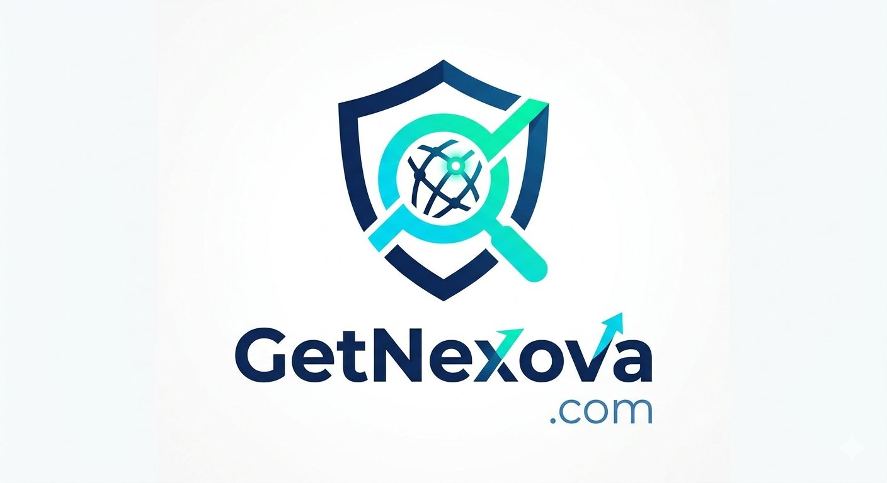

<p align="center">
  
</p>

<h1 align="center">GetNexova v4.0.0 OMEGA</h1>
<p align="center">
  <strong>AI-Powered Bug Bounty Automation Platform</strong>
</p>
<p align="center">
  Authorized vulnerability discovery and analysis for bug bounty programs
</p>

---

## Overview

GetNexova is an advanced bug bounty automation platform that combines industry-standard security tools with AI-powered analysis to discover, classify, and report vulnerabilities. Built for authorized security research on platforms like **Intigriti**, **YesWeHack**, and **HackerOne**.

### Key Features

- **16-Phase Pipeline** — Automated flow from reconnaissance to professional report generation
- **Unified AI Engine (LiteLLM)** — Provider-agnostic LLM calls with tiered fallback: Free (Groq/Gemini) → Paid (Claude) → Local (Ollama)
- **GitAgent Architecture** — Each AI agent has a defined identity (YAML + SOUL.md) for consistent, specialized behavior
- **3 Scan Modes** — Quick (surface), Standard (thorough), Deep (comprehensive with advanced tools)
- **Attack Chain Discovery** — AI identifies how low-severity findings combine into critical impact
- **Dual Validation** — Tool findings + AI classification to minimize false positives
- **CVSS v3.1 Scoring** — Automated, accurate severity scoring with full vector justification
- **Multi-Format Reports** — HTML, Markdown, JSON — platform-ready for direct submission
- **Continuous Learning** — Learns from validated findings to improve over time
- **Budget Controls** — Per-run and monthly LLM cost limits with real-time tracking
- **Docker Microservices** — Containerized deployment with a separate advanced tools container
- **Multi-Channel Notifications** — Discord, Slack, Telegram alerts for findings
- **Scope Enforcement** — Strict boundary checking ensures scans stay within authorized targets
- **Knowledge Base** — Encrypted SQLite storage of scan history and patterns

---

## Architecture

```
┌─────────────────────────────────────────────────────────┐
│                    GetNexova Engine                       │
│  ┌──────────┐  ┌──────────┐  ┌────────────┐  ┌───────┐ │
│  │ Planner  │→ │ Scanner  │→ │ Researcher │→ │Reporter│ │
│  │  Agent   │  │  Agent   │  │   Agent    │  │ Agent  │ │
│  └──────────┘  └──────────┘  └────────────┘  └───────┘ │
│       │             │              │              │      │
│  ┌────▼─────────────▼──────────────▼──────────────▼────┐│
│  │              Unified AI Engine (LiteLLM)             ││
│  │     Groq → Gemini → Claude → Ollama (fallback)      ││
│  └─────────────────────────────────────────────────────┘│
│  ┌──────────────┐  ┌──────────────┐  ┌────────────────┐│
│  │ Knowledge DB │  │   Learner    │  │  Notifications ││
│  │  (SQLite)    │  │  (Patterns)  │  │ Discord/Slack  ││
│  └──────────────┘  └──────────────┘  └────────────────┘│
└──────────────┬──────────────────────────────────────────┘
               │ REST API
┌──────────────▼──────────────────────────────────────────┐
│            Advanced Tools Container (Docker)              │
│  nmap │ nikto │ dnsrecon │ gitleaks │ semgrep │ wpscan   │
└──────────────────────────────────────────────────────────┘
```

---

## Quick Start

### Option 1: Docker (Recommended)

```bash
# Clone the repository
git clone https://github.com/lord10110/GetNexova.git
cd GetNexova

# Configure environment
cp .env.example .env
# Edit .env with your API keys

# Build and run
docker compose build
docker compose run nexova -t target.com --mode standard
```

### Option 2: Local Installation

```bash
# Clone
git clone https://github.com/lord10110/GetNexova.git
cd GetNexova

# Python environment
python3 -m venv venv
source venv/bin/activate
pip install -r requirements.txt

# Configure
cp .env.example .env
# Edit .env with your API keys

# Install security tools (see INSTALL_GUIDE.md for details)

# Run
python cli.py -t target.com --mode standard
```

---

## Usage

### Basic Commands

```bash
# Standard scan (default)
nexova -t example.com

# Quick surface scan
nexova -t example.com --mode quick

# Deep comprehensive scan (requires Docker advanced tools)
nexova -t example.com --mode deep

# Tools only, no AI analysis
nexova -t example.com --no-ai

# Specific report format
nexova -t example.com --report-format html

# With scope exclusions
nexova -t example.com --exclude staging.example.com dev.example.com

# Custom budget limit
nexova -t example.com --max-cost 2.0

# Check tool availability
nexova --health-check

# View knowledge base stats
nexova --stats
```

### Scan Modes

| Mode | Description | Typical Duration | Tools Used |
|------|-------------|------------------|------------|
| `quick` | Fast surface scan — subdomains + HTTP probing | 2-5 min | subfinder, httpx |
| `standard` | Thorough scan — adds vulnerability scanning + XSS | 15-30 min | + nuclei, dalfox |
| `deep` | Comprehensive — network scan, web scanners, code analysis | 30-90 min | + nmap, nikto, gitleaks, semgrep |

---

## Configuration

### Environment Variables

| Variable | Description | Required |
|----------|-------------|----------|
| `GROQ_API_KEY` | Groq API key (free) | Recommended |
| `GEMINI_API_KEY` | Google Gemini API key (free) | Recommended |
| `ANTHROPIC_API_KEY` | Anthropic API key (paid fallback) | Optional |
| `OLLAMA_BASE_URL` | Ollama server URL | Optional |
| `MAX_COST_PER_RUN` | Budget limit per run (USD) | Optional (default: 5.0) |
| `DISCORD_WEBHOOK` | Discord webhook URL | Optional |
| `SLACK_WEBHOOK` | Slack webhook URL | Optional |
| `TELEGRAM_BOT_TOKEN` | Telegram bot token | Optional |
| `TELEGRAM_CHAT_ID` | Telegram chat ID | Optional |

### JSON Config File

Override defaults with a JSON file:

```bash
nexova -t target.com --config myconfig.json
```

```json
{
  "llm": {
    "max_cost_per_run": 10.0,
    "max_retries": 5
  },
  "scan": {
    "timeout_per_tool": 600,
    "max_concurrent_scans": 5
  }
}
```

---

## Agent Definitions

Each agent is defined in `agents_definitions/<agent>/`:
- `agent.yaml` — Configuration, model preferences, skills
- `SOUL.md` — Identity, personality, behavioral principles

See [AGENTS_DEFINITIONS.md](docs/AGENTS_DEFINITIONS.md) for customization guide.

---

## Project Structure

```
GetNexova/
├── cli.py                     # CLI entry point
├── nexova.py                  # Main orchestrator
├── core/
│   ├── config.py              # Configuration management
│   ├── logging_config.py      # Structured logging
│   ├── tool_health.py         # Tool availability checks
│   ├── scope.py               # Scope enforcement
│   └── cost_tracker.py        # LLM cost tracking
├── agents/
│   ├── ai_engine.py           # Unified LLM engine (LiteLLM)
│   ├── agent_loader.py        # GitAgent definition loader
│   ├── planner.py             # Reconnaissance planner
│   ├── scanner.py             # Tool executor
│   ├── researcher.py          # AI vulnerability analyst
│   └── reporter.py            # Report generator
├── agents_definitions/        # GitAgent YAML + SOUL.md
├── integrations/
│   ├── notifications.py       # Discord/Slack/Telegram
│   ├── clawteam.py            # Advanced tools dispatcher
│   └── advanced_api.py        # Flask API for tools container
├── skills/
│   ├── continuous_learning/   # Pattern learning system
│   └── strategic_compact/     # Prompt compression
├── memory/
│   └── knowledge_base.py      # SQLite knowledge storage
├── tests/                     # Test suite
├── docker-compose.yml         # Docker deployment
├── Dockerfile                 # Main container
└── requirements.txt           # Python dependencies
```

---

## Testing

```bash
# Run all tests
pytest tests/ -v

# With coverage
pytest tests/ --cov=. --cov-report=html

# Specific test class
pytest tests/test_core.py::TestScopeEnforcer -v
```

---

## License

This project is for authorized security research only. Always ensure you have explicit permission before scanning any target. Use responsibly within bug bounty program scopes.

---

<p align="center">
  <strong>GetNexova v4.0.0 OMEGA</strong> — Built for responsible security research
</p>
